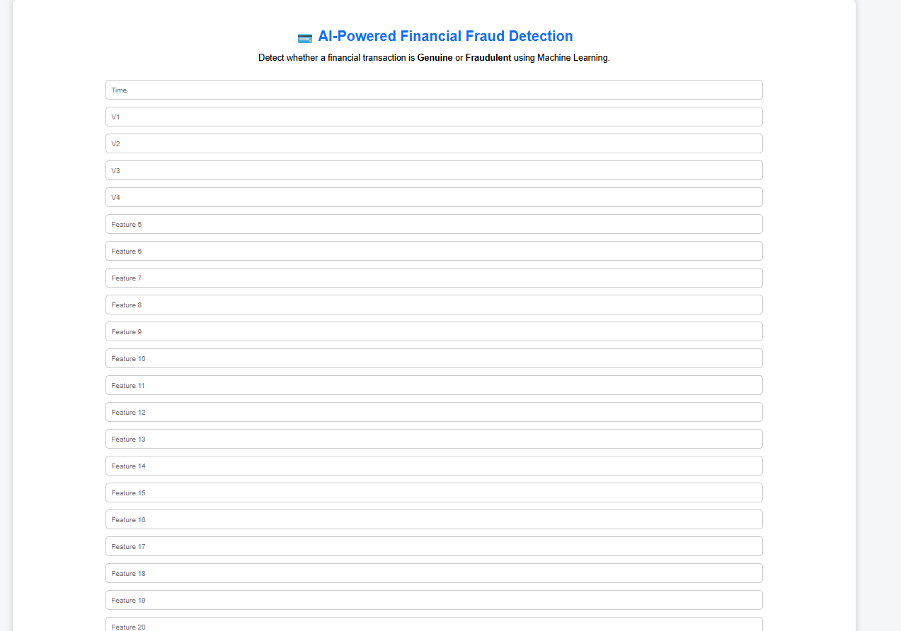
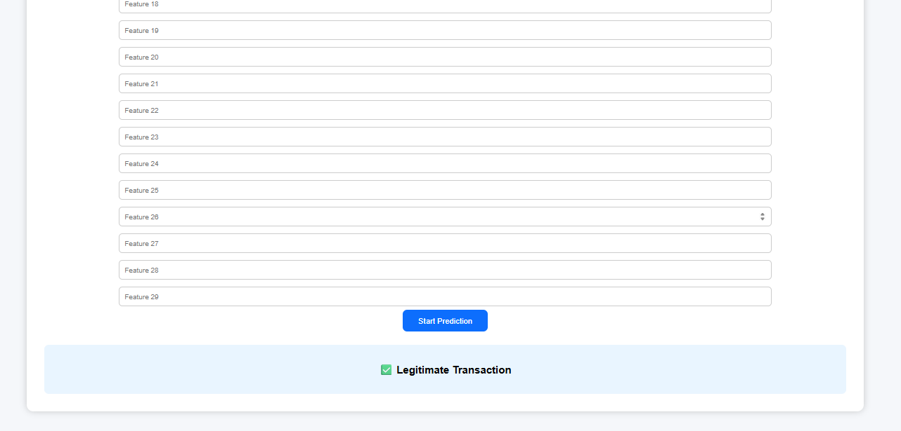
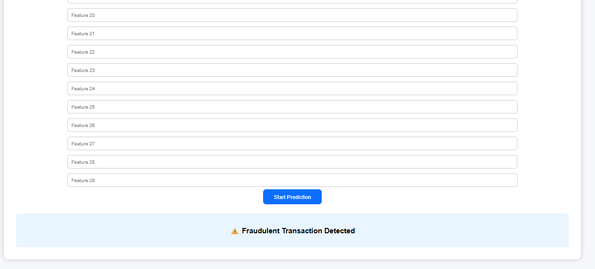
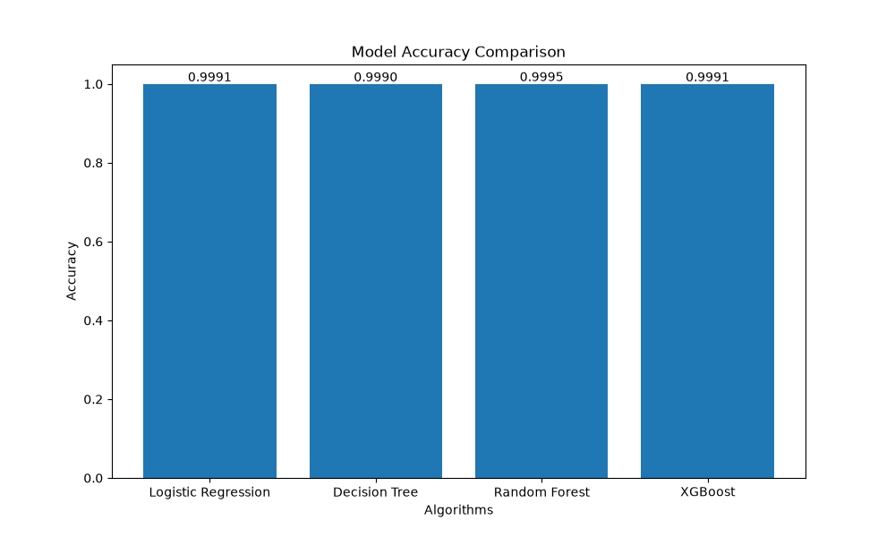

# 💳 AI-Powered Financial Fraud Detection System

An end-to-end Machine Learning based application that detects fraudulent financial transactions using multiple classification algorithms and provides real-time predictions through a Flask web application.

---

#  LIVE DEMO LINK

https://yashvi-chaudhary-ai-powered-financial-f-srcstreamlit-app-2rgweo.streamlit.app/

## 📌 Project Overview

Financial fraud detection is a critical challenge in the banking and financial sector. This project uses Machine Learning techniques to classify transactions as:

- ✅ Genuine Transactions
- ⚠️ Fraudulent Transactions

The system analyzes transaction patterns and predicts whether a transaction is suspicious or legitimate.

---

# 🚀 Features

✔ Data preprocessing and cleaning  
✔ Duplicate transaction removal  
✔ Exploratory Data Analysis (EDA)  
✔ Class distribution analysis  
✔ Feature scaling using StandardScaler  
✔ Multiple Machine Learning model training  
✔ Model performance comparison  
✔ Random Forest based fraud prediction  
✔ Flask web application deployment  
✔ Real-time transaction classification  

---

# 🧠 Machine Learning Workflow

The project follows the complete ML pipeline:

```
Data Collection
        ↓
Data Cleaning
        ↓
Exploratory Data Analysis
        ↓
Feature Selection
        ↓
Train-Test Split
        ↓
Feature Scaling
        ↓
Model Training
        ↓
Model Evaluation
        ↓
Model Saving
        ↓
Flask Deployment
```

---

# 🤖 Machine Learning Algorithms Used

The following classification algorithms were trained and evaluated:

| Algorithm | Accuracy | Precision | Recall | F1 Score |
|-----------|----------|-----------|--------|----------|
| Logistic Regression | 99.91% | 84.62% | 57.89% | 68.75% |
| Decision Tree | 99.90% | 72.04% | 70.53% | 71.28% |
| Random Forest | 99.95% | 97.18% | 72.63% | 83.13% |
| XGBoost | 99.91% | 75.00% | 69.47% | 72.13% |

---

# 🏆 Best Performing Model

## Random Forest Classifier

Random Forest was selected as the final deployment model because it achieved:

- Accuracy: **99.95%**
- Precision: **97.18%**
- Recall: **72.63%**
- F1 Score: **83.13%**

The trained model is saved as:

```
models/fraud_detection_model.pkl
```

---

# 🛠️ Tech Stack

### Programming Language
- Python

### Machine Learning Libraries
- Pandas
- NumPy
- Scikit-learn
- XGBoost
- Joblib

### Visualization
- Matplotlib

### Web Development
- Flask
- HTML
- CSS

---

# 📂 Project Structure

```
AI-Powered Financial Fraud Detection
│
├── dataset
│   └── creditcard.csv
│
├── models
│   ├── fraud_detection_model.pkl
│   ├── decision_tree_model.pkl
│   ├── xgboost_model.pkl
│   └── scaler.pkl
│
├── src
│   └── main.py
│
├── templates
│   └── index.html
│
├── static
│   └── style.css
│
├── app.py
├── requirements.txt
└── README.md
```

---

# ⚙️ Installation & Setup

## 1. Clone the repository

```bash
git clone git clone https://github.com/yashvi-chaudhary/AI-Powered-Financial-Fraud-Detection.git
```

## 2. Navigate to project directory

```bash
cd AI-Powered-Financial-Fraud-Detection
```

## 3. Install dependencies

```bash
pip install -r requirements.txt
```

---

# ▶️ How to Run the Application

Run Flask application:

```bash
python app.py
```

Open browser:

```
http://127.0.0.1:5000/
```

Enter transaction details and click:

```
Start Prediction
```

The system will classify the transaction as:

```
✅ Legitimate Transaction

or

⚠️ Fraudulent Transaction Detected
```

---

# 📊 Dataset Information

Dataset used:

Credit Card Fraud Detection Dataset

Dataset contains:

- 284,807 transactions
- 30 input features
- 1 target variable (Class)

Target:

```
0 → Genuine Transaction
1 → Fraudulent Transaction
```

---

# 🔮 Future Improvements

- Add fraud probability score
- Improve user-friendly dashboard
- Add transaction history tracking
- Deploy application on cloud platform
- Add deep learning based fraud detection

---

## 📥 Dataset

The original dataset (`creditcard.csv`) is not included in this repository due to GitHub file size limitations.

You can download it from the Kaggle Credit Card Fraud Detection dataset and place it inside the `dataset/` folder before running the project.

Expected path:

```text
dataset/
└── creditcard.csv
```

---

# 📸 Application Screenshots

## 🏠 Home Page



---

## ✅ Legitimate Transaction Prediction



---

## ⚠️ Fraudulent Transaction Prediction



---

## 📊 Model Comparison



---

# 👩‍💻 Author

**Yashvi Chaudhary**

AI / Machine Learning Project
